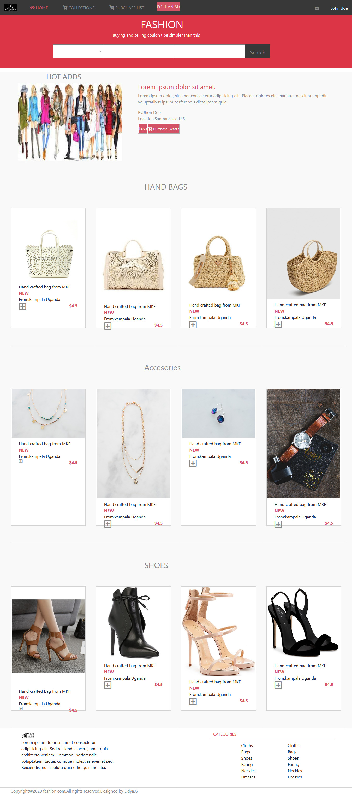

# Fashion-online-shop

capstone project of HTML and CSS

This is a project to demonstrate the existing knowledge of HTML and CSS. It is a solo project which recreates a responsive website of Fashion online shop.

## Built With
 HTML5
 CSS3
 GIT
 VSCODE

## Live Demo
Live Demo : [The-livedemo-link](https://cranky-meitner-f0ec56.netlify.app)

<h1>Getting Started</h1>

To get a local copy up and running follow these simple example steps.

Prerequisites Text editor,Github profile and Git.

<h2>Authors</h2>

👤 Author1

- Github: [@Lidya-github ](https://github.com/Lidya1234)
- Twitter: [@Lidya-twitter](https://twitter.com/Lidya42676629)
- Linkedin: [Lidya-linkedin-link](https://www.linkedin.com/in/lidya-ghebreigziabher-4a94391aa/)

🤝 Contributing Contributions, issues and feature requests are welcome!

Feel free to check the issues page.

Show your support Give a ⭐️ if you like this project!

Acknowledgments Hat tip to anyone whose code was used Inspiration etc

📝 License This project is a collaboration project of microverse students. All rights are reserved for Lidya G.
